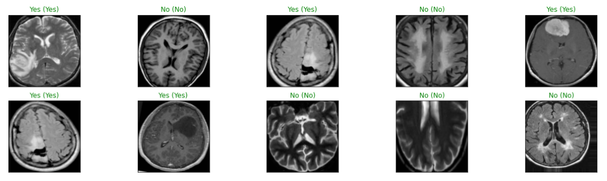

# Brain-Tumor-Detection

## Table of contents

* [Introduction](#introduction)

* [Dataset](#dataset)

* [Framework](#framework)

* [Steps](#steps)

* [Output](#output)

## Introduction
A deep learning based model is developed to detect brain tumor from MRI images. Transfer learning technique has been used for detection.

## Dataset
Original dataset used in this project has been collected from <a href="https://www.kaggle.com/navoneel/brain-mri-images-for-brain-tumor-detection">Kaggle</a> which contains 
253 MRI images of the brain.

## Framework
This code is based on Keras, which requires Tensorflow as the backend. 

## Steps
Steps needed to complete the whole task are as follows:
1. Data Collection
2. Image Augmentation
3. Data Preprocessing
4. Data Normalization
5. Set up Pre-Trained VGG19 Model
6. Train and Validate
7. Performance Evaluation

## Output
Following image shows 10 random test images, their predicted labels and ground truth.

 
 

